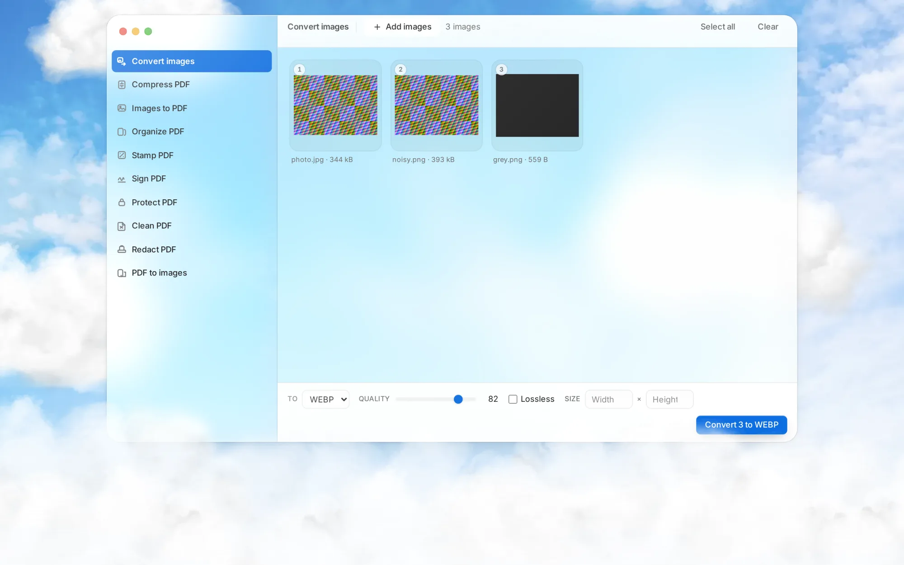

# convert.in

[](https://github.com/kevinpradith/convert.in/actions/workflows/ci.yml)
[](LICENSE)
[](package.json)
[](https://github.com/kevinpradith/convert.in/releases/latest)

Local image and PDF tools. The web app does all of its work inside the browser and
the CLI does all of its work on your machine, so no file is ever uploaded anywhere.




<sup>Both are captures of the built application in Chromium, shrunk by
<code>convert.in convert --to webp</code>. They are pictures of the thing that ships,
not mock-ups.</sup>

## Contents

- [Quick start](#quick-start)
- [What it does](#what-it-does)
- [Design](#design)
- [Performance](#performance)
- [Security](#security)
- [Hosting it](#hosting-it)
- [Command line](#command-line)
- [How it works](#how-it-works)
- [Development](#development)
- [Deliberate limits](#deliberate-limits)
- [Licence](#licence)
- [Project](#project)

## Quick start

Node 20.19 or newer, and nothing else. Nothing here needs an account, a server,
or a network connection once the page has loaded.

**In a browser.** Run it, or build the static output and host it anywhere:

```sh
npm install
npm run dev       # http://localhost:5173
npm run build     # static files in dist/, host them anywhere or open them locally
```

**On the command line.** From the project folder:

```sh
npm link
convert.in --help
```

`npm link` writes the shims Windows, macOS and Linux each need. The alternative
for a machine where npm's global prefix wants root is under
[Command line](#command-line).

## What it does

One page: a headline that says what this is, and the window with the tools in
it directly under it. There is no second page and no route to navigate to, so
opening the tools is a scroll rather than a load.

Ten tools, all in one window:

| Tool | What it does |
| --- | --- |
| **Convert images** | PNG, JPEG, WebP, AVIF and JPEG XL, in any direction, plus GIF, BMP, TIFF, ICO, HEIC and SVG on the way in. Scales on the way out. Shows what each file cost or saved. |
| **Compress PDF** | Re-encodes the pictures inside, which is where nearly all the weight of a scan is. Give it the limit the upload form asked for and it works out its own settings. Says so when a file has nothing to shrink. Takes a pile. |
| **Sign PDF** | Draw a signature or bring a PNG of one, and place it on a page. One signature covers however many files you drop. |
| **Images to PDF** | Any image in, one image per page, in the order a person would count them. Pages are sized by the resolution the image claims, and a photo taken sideways comes out upright. Fit-to-image, A4 or Letter, with an optional margin. |
| **Organize PDF** | Drop any number of PDFs, then reorder, rotate, delete and duplicate pages, and put them all on one sheet if you like. Bookmarks come with their pages. Save the result as one file or as one file per page. |
| **Clean PDF** | Lists what the file says about whoever made it, then takes it out: the information dictionary, the XMP packet, and the custom keys the software that wrote it added. |
| **Redact PDF** | Drag a rectangle, or search for a word and black out every occurrence. What is covered is then removed rather than hidden: the pages are rebuilt from pixels, so nothing survives underneath to be selected or copied. |
| **Stamp PDF** | A watermark across the pages, or page numbers on them. One file lets you select tiles; a pile gets stamped through. |
| **Protect PDF** | Lock with a password, or hand it locked files and take the password off. One password covers the pile. Says so when a file asks for a password but leaves its pages readable anyway. |
| **PDF to images** | Rasterise pages to PNG or JPEG at 72, 144 or 300 dpi. |

Drop files anywhere in the window, drag tiles to reorder, click a tile to select
it, or type a range like `1-3,7` into the Pages box in the toolbar.

### No file limits, because there is nobody to bill for them

Every tool that turns one file into one file takes as many as you can give it,
in the window and on the command line alike, and every command except `split`
does the same:

```sh
convert.in compress scans/*.pdf --quality 40 -o small/
convert.in protect statements/*.pdf --open-password ...
convert.in number *.pdf -o numbered/
```

Nothing is queued, metered or counted, because nothing is being paid for: the
work happens on the machine you are sitting at. In the window the button counts
what it is about to do, and Download hands back every result at once. On the
command line, every output name is worked out before the first file is written,
so a run that would overwrite something, or land two inputs on the same name,
stops before it has done half the job.

### Web and CLI, side by side

Both sit on the same `src/core`, so a change lands in both at once, and page
ranges are parsed by the same function down to the error messages.

| What you want | In the window | On the command line |
| --- | --- | --- |
| One image format into another | Convert images | `convert` |
| Scale an image | Convert images, the size boxes | `convert --width` |
| Make a scanned PDF smaller | Compress PDF | `compress` |
| Put a signature on a page | Sign PDF | `sign` |
| Images into one PDF | Images to PDF | `images` |
| Join documents | Organize, drop several | `merge` |
| Reorder, delete, extract | Organize, drag and select | `select` |
| Turn pages | Organize, the rotate buttons | `rotate` |
| One file per chunk | Organize, Save pages separately | `split` |
| Watermark | Stamp, Watermark | `watermark` |
| Page numbers | Stamp, Page numbers | `number` |
| Lock with a password | Protect | `protect` |
| Take a password off | Protect, it detects the lock | `unlock` |
| What is in this file | the count in the toolbar | `info` |
| Pages out as images | PDF to images | none: it needs a canvas |

Two flags are deliberately CLI-only. `--force` has no meaning in a browser, where
a download never overwrites anything. `--sort natural` has none either, because
there you drag the tiles into the order you want.

Language (English, Indonesia) sits at the bottom of the sidebar and is
remembered in `localStorage`. There is one appearance and it is light: the
window is glass over a photograph, which a dark palette has nothing to be.

## Design

Three sections: what the interface is made of, the type and spacing it is set
on, and how both survive a phone.

### Look

Apple's current design language: translucent layers over a backdrop, radii that
nest concentrically (an inner radius is its parent's minus the padding between
them), and controls sized the way a Mac sizes them.

The backdrop is a photograph of a sky, which is what the glass has to refract.
Everything above it is white at partial opacity, so the surfaces take their
colour from what is behind them rather than from a token. One accent, `#0d6ee0`,
is spent only on what a person acts on: the primary button, the current
selection, the active tool, the focus ring. It measures 4.87:1 against the white
it carries, which clears WCAG 2.2 AA for text of any size.

Depth does the rest: layered shadows, a lit top edge on every pane, and a 4.5%
film of SVG noise so the large soft gradients do not band on 8-bit displays.

One palette, declared once. There is no dark variant to keep in sync and no
switch to keep both honest under: the window is glass over a photograph, and a
dark palette has nothing to be underneath it.

The three accessibility settings Apple's own glass was criticised for ignoring
are honoured: `prefers-reduced-transparency` drops the blur and makes surfaces
opaque, `prefers-contrast: more` strengthens borders and secondary text, and
`prefers-reduced-motion` removes the transitions.

### Scale

Type follows the macOS text styles, named as Apple names them: caption 11,
footnote 12, body 13, headline 15, title 17, display 21. Body is 13 because that
is what a Mac window uses. Spacing and control heights sit on the 4pt grid.

The golden ratio is used where it does real work and not as a grid: the display
step is body x 1.618, and the empty-state icon nests 40 inside 64. Line length is
capped in `ch` rather than pixels, because that is what readability depends on.

### Responsive

One layout, three shapes:

| Width | Shape |
| --- | --- |
| `< 640px` | Edge to edge, no window chrome, two tile columns, toolbars scroll sideways behind a fade |
| `640–1023px` | Floating window, sidebar still behind the menu button |
| `>= 1024px` | Sidebar pinned open |

Below 1024px the sidebar becomes a drawer rather than a second navigation: it is
the same component, so there is one thing to keep correct. The drawer is a
native `<dialog>` opened with `showModal()`, which is where the modal role, the
focus trap, the inert background, Escape and the return of focus to the button
that opened it all come from without being written. Picking a tool closes it,
and so does crossing back above 1024px.

On a coarse pointer every control grows to the 44px minimum touch target, and
the per-tile remove button stops hiding behind hover, since there is no hover to
reveal it. The viewport uses `dvh` so a phone's disappearing toolbar cannot crop
the footer, and `env(safe-area-inset-*)` keeps the interface clear of notches.

## Performance

The page has to be a page before the application is one. Everything below is
measured against `dist/`, served gzipped with the headers this project ships.

- **The hero is in the HTML.** `scripts/prerender.mts` renders the same
  component the app mounts and writes it into `dist/index.html`, so the largest
  paint is text the browser already has rather than something React has yet to
  produce. React mounts over the top and replaces those nodes with its own; the
  two agree because they are the same component, and the entrance animation is
  suppressed on the replacements so nothing moves twice.
- **The stylesheet is inlined.** It is 9.9 kB gzipped and it blocks the first
  paint, so as a separate file it cost a round trip before the browser knew what
  the page looked like, and another before it learned the fonts existed. There
  is one HTML page here and the CSS is rebuilt with it, so there was nothing to
  lose by giving up its cache entry. The first response is 12.2 kB gzipped and
  carries the whole first screen.
- **The bundle waits for it.** The 76 kB gzipped entry chunk is loaded from
  `boot.js` on `load`, with a two-second timer behind it in case `load` never
  fires. It is a file rather than an inline script because the CSP allows
  neither inline script nor `eval`, and three lines are not worth weakening it
  for.
- **A PDF writer is not downloaded to convert a PNG.** pdf-lib is 278 kB
  gzipped and shared by seven of the ten tools, so it landed in the chunk they
  have in common, which is also the one the image converter needs. It is named
  as its own group in `vite.config.ts` instead. pdf.js is larger still, and its
  worker is now configured inside the module that opens it rather than at
  start-up, so it is fetched by the tools that rasterise and by nobody else.
- **Two typefaces, both cut down and served from here.** No third-party font
  host, which the CSP would refuse anyway. The display italic exists for one
  line of the page, so it is subset to the twenty-two characters the two
  headlines spell: 39 KiB becomes 7 KiB, and `test/display-font.test.ts` fails
  if the headline is ever reworded past that alphabet.

Lighthouse against that build, emulated mobile, throttled: **99** performance,
**100** accessibility, **100** best practices, **100** SEO. Largest paint 2.1 s,
total blocking time 0 ms, layout shift 0.018.

## Security

`npm audit` reports no vulnerabilities in either the runtime or the development
tree. There is no `eval`, no `innerHTML`, no shell invocation anywhere in the
source. `localStorage` holds the chosen language and nothing else; a
password is never written to it.

Every GitHub Actions step is pinned to a commit rather than a tag, because a tag
is a moving pointer and moving one is exactly how `tj-actions/changed-files` was
turned into a secret exfiltrator across 23,000 repositories in March 2025
(CVE-2025-30066). The workflow token is read-only at the top level, and the
checkout step is told not to leave it in `.git/config`. CodeQL analyses every
push and pull request with the `security-extended` pack, and Dependabot watches
npm, the actions themselves and the two Python packages the suites install.

The browser suite asserts that the page makes **no off-origin request at all**
while running a full convert, stamp, lock and unlock cycle. Only the origin it
was served from, plus `blob:` and `data:`, are allowed; anything else fails the
test. That is the claim on the sidebar, kept honest by a test rather than a
promise.

Three defects this sweep turned up, all fixed:

- **The page-range parser backtracked quadratically.** One regex held two
  optional `\d+` groups, so a hundred thousand digits followed by one stray
  character took 11.6 seconds to reject. Splitting on the dash first leaves only
  anchored `/^\d+$/` tests: the same input is now rejected in 0.2 ms, and a
  million characters take 1.1 ms. A test holds the line.
- **The password prompt could have started echoing.** Hiding what is typed
  relies on replacing a readline internal. If a future Node drops it, the prompt
  now refuses and points at the piped form instead of printing the password
  across the terminal.
- **`crypto.randomUUID` is only defined in a secure context**, so the built app
  served over plain http from another machine would have crashed on the first
  dropped file. The ids are React keys, not secrets, so there is a fallback.

## Hosting it

The build is static files and nothing else: no server, no environment variables,
no API routes, so there is no server side to misconfigure or leak. `base` is
`'./'`, so it works from a subdirectory too, such as a GitHub Pages project site.

```sh
npm run build      # -> dist/
```

Drop `dist/` on Vercel, Netlify, Cloudflare Pages, GitHub Pages, or any static
host. `vercel.json` carries the build settings and the response headers;
`public/_headers` carries the identical headers for Netlify and Cloudflare Pages,
generated from the same values so the two cannot drift.

The headers set a strict Content-Security-Policy: `default-src 'self'`,
`connect-src 'self'`, `object-src 'none'`, `frame-ancestors 'none'`. A privacy
tool should not merely promise it never uploads anything; the CSP means that even
a compromised dependency has nowhere to send a file. The whole browser suite is
re-run against the built output served with these exact headers, so the policy is
known to be one the app can actually live under rather than one that looks good
in a config file. A test asserts the two header files still agree, because they
are maintained by hand and a policy that drifts between hosts is worse than no
policy at all.

The pages are also cross-origin isolated, with `Cross-Origin-Opener-Policy:
same-origin` and `Cross-Origin-Embedder-Policy: require-corp`. Every asset here
is same-origin, so the cost is nothing, and it puts the document in its own
process group where a Spectre-class read of another origin's memory has nothing
to reach.

`require-trusted-types-for 'script'` is **not** set, and that is a decision
rather than an omission. It was tested: pdf.js ships no Trusted Types policy of
its own, so the directive blocks it from starting its worker and it silently
falls back to decoding pages on the main thread. Adding a default policy that
waves script URLs through would satisfy the directive and defend against
nothing. The app has no HTML sinks at all — no `innerHTML`, no
`dangerouslySetInnerHTML`, no `eval` — which is what the directive exists to
protect, so the honest position is to say so here.

`script-src` carries one addition, `'wasm-unsafe-eval'`. pdf.js decodes JBIG2 and
JPEG 2000 images in WebAssembly, and browsers refuse to compile a WebAssembly
module under a CSP that does not say so. The keyword permits exactly that and
nothing else: `eval` and the `Function` constructor stay blocked, which the
browser suite checks by running both from a real same-origin script rather than
through the automation channel, since that channel is exempt from CSP and would
have reported a pass either way.

Two things to keep in mind:

- **Serve it over HTTPS.** Encryption itself does not need a secure context, as
  `crypto.getRandomValues` is available either way, but everything else about
  handling someone's documents over plain http is a bad idea. Vercel, Netlify
  and Cloudflare all do HTTPS by default.
- **Do not switch on the host's analytics.** Vercel Analytics and Speed Insights
  inject a script that reports page views. It never sees a file, but it does make
  "nothing leaves this browser" less true than it is now, and it would be the
  first thing to fail the off-origin test.

## Command line

`npm link` works the same on Windows, macOS and Linux: npm writes `convert.in`
shims into its own bin directory, including the `.cmd` and `.ps1` ones Windows
needs. The launcher is a Node script rather than a shell script for exactly
that reason, and because a shell script's executable bit does not survive a
checkout on Windows.

If npm's global prefix needs root on your machine, point a symlink at it
instead:

```sh
ln -s "$PWD/bin/convert.in.mjs" ~/.local/bin/convert.in
```

Then:

```sh
convert.in                         # banner and the full guide
convert.in help id                 # the same guide in Bahasa Indonesia

convert.in convert photo.png --to webp     # -> photo.webp, beside the input
convert.in convert *.heic --to jpeg -o out/
convert.in convert logo.png --to webp --lossless
convert.in images shot-*.png       # -> shot.pdf, beside the first input
convert.in images scan-*.jpg -o scan.pdf --size a4 --margin 24
convert.in compress passport.pdf --max-size 500kb
convert.in merge part-1.pdf part-2.pdf -o whole.pdf
convert.in select scan.pdf 1-3,7   # -> scan-selected.pdf
convert.in rotate scan.pdf 90 --pages 2-4
convert.in rotate scan.pdf 180 --pages even   # the half a duplex feeder flipped
convert.in resize report.pdf a4    # every page on one sheet, scaled to fit
convert.in split book.pdf 10       # -> book-pages/
convert.in protect scan.pdf        # asks for the password, never takes it from argv
convert.in unlock locked.pdf
convert.in watermark scan.pdf "CONFIDENTIAL" --opacity 0.2
convert.in number report.pdf --format "{n} / {total}" --position bottom-right
convert.in info offer.pdf          # pages and size, what it says about who made
                                   # it, and what its encryption really covers
convert.in clean offer.pdf         # -> offer-clean.pdf, saying nothing
```

`-o` is optional: without it the result is named after the input and written
beside it. With several inputs the name comes from what they share, so
`shot1.png … shot12.png` becomes `shot.pdf`. Nothing is overwritten without
`--force`.

Page order is the order the files arrive in, which is however your shell
expanded the glob. Most shells put `shot10.png` before `shot2.png`; this zsh has
`numeric_glob_sort` on, so it does not. `--sort natural` counts the way you do,
and a warning is printed whenever the incoming order looks lexical.

Pages are 1-based, `1-3,7` and `8-` both work, and repeating a page duplicates
it. `select`, `rotate` and `split` take their argument positionally or as a flag,
so `select scan.pdf 1-3` and `select scan.pdf --pages 1-3` are the same thing.

Windows paths are translated automatically, so `'C:\Users\me\shot.png'` resolves
to `/mnt/c/Users/me/shot.png`. Quote it, or the shell eats the backslashes before
the CLI ever sees them.

### Image formats

`convert` reads PNG, JPEG, WebP, AVIF and JPEG XL and writes the same five. The
browser app reads six more, GIF, BMP, TIFF, ICO, HEIC and SVG, because the only
decoders for those are the ones a browser already ships.

Both surfaces run the same WebAssembly codecs, the ones
[Squoosh](https://github.com/GoogleChromeLabs/squoosh) settled on after
measuring, packaged as [jSquash](https://github.com/jamsinclair/jSquash) and
licensed Apache-2.0: MozJPEG, libwebp, libavif, libjxl and Oxipng. So a file
converted in the window and the same file converted at the prompt come out
identical. They are loaded on demand, because the AVIF encoder alone is 3.5 MB
and nobody should download it to turn a PNG into a JPEG.

The browser decodes with `createImageBitmap` first and falls back to those same
codecs, which is what makes the extra six formats work and what makes JPEG XL
work in a browser that has never heard of it.

Quality is 1 to 100. The scales are not comparable between formats, so the
defaults are deliberately different numbers, chosen to look alike rather than to
read alike. JPEG 80 is the long-standing web default and the point past which
MozJPEG's gains flatten out; the WebP and AVIF figures come from
[Malte Ubl's DSSIM measurements](https://www.industrialempathy.com/posts/avif-webp-quality-settings/)
against JPEG at matched quality; JPEG XL's is libjxl's own.

| Format | Default | Why |
| --- | --- | --- |
| JPEG | 80 | the reference |
| WebP | 82 | measured equal to JPEG 80 |
| AVIF | 64 | measured equal to JPEG 80, at roughly a third off the size |
| JPEG XL | 75 | libjxl's default, on the libjpeg scale |
| PNG | lossless | then run through Oxipng, which on flat graphics is routinely an order of magnitude |

Three things happen to a file on the way through, and all three are the point.

**Metadata is dropped.** Converting decodes to pixels and encodes again, so EXIF,
GPS coordinates, camera serial numbers, editing history and colour profiles are
left behind. A photo posted straight from a phone otherwise carries where it was
taken.

**A sideways photo is turned the right way up.** JPEG records the camera angle in
a tag rather than in the pixels, and
[no other format carries that tag](https://zpl.fi/exif-orientation-in-different-formats/),
so the rotation is baked into the pixels instead. Both sides do this: the
browser through `createImageBitmap`'s `imageOrientation: 'from-image'`, and the
CLI through MozJPEG's own orientation handling. `test/browser/suite.py` bolts an
orientation tag onto a JPEG by hand and checks a 240x180 file comes out 180x240.

**Transparency is flattened for JPEG**, which has no alpha channel, onto
`--background` (white unless told otherwise). Every other format keeps it. Without
this, transparent pixels land on whatever was underneath them, which in most
drawing tools is black.

Animation is not kept: an animated GIF or WebP converts as its first frame.

### Passwords

Encryption is AES-256 written as `V 5` / `R 6`, which is the setting Acrobat
calls **Acrobat X and later**, its strongest. The test suite reads those markers
straight out of the produced bytes rather than trusting the library.

Acrobat's two passwords are both here. The **open password** is needed to read
the file at all; the **permissions password** lifts the restrictions (printing,
changes, copying). Acrobat refuses to let the two be identical and so does this:
if they match, anyone who can open the file already holds owner rights and the
restrictions are decoration.

The CLI asks for passwords rather than taking them as arguments, because a
password in `argv` lands in shell history and is visible in `ps`. Pipe one in for
scripts:

```sh
printf '%s' "$PASSWORD" | convert.in unlock locked.pdf
```

Passing `--open-password` or `--password` still works and prints a warning saying
why it is a bad idea. In the web app, password fields are never persisted and are
cleared as soon as the file is saved.

Screen-reader access is always permitted, which is what Acrobat also forces for
256-bit AES. Denying a screen reader is not a restriction worth offering.

#### What it does not do

Three limits are worth stating plainly, because none of them are defects in this
tool: they are properties of the format, and they hold for Acrobat too.

**Permissions are a request, not a lock.** Printing, copying and editing are bits
in the `/P` field that a reader is expected to honour. Revision 6 stores them
again inside the encrypted `/Perms` entry, so tampering with them is detectable,
but a reader that simply ignores `/P` will print the document anyway.

Two consequences are worth being blunt about, because both were confirmed
against this tool rather than assumed:

- **Whoever holds the open password can remove the restrictions**, including
  with `convert.in unlock`. Anyone able to decrypt the file holds the file
  encryption key, and the permissions password protects nothing from them. Set
  restrictions to state an intention, not to enforce one against a reader who
  already has the document open.
- **A permissions-only file comes apart with no password at all.** Its open
  password is empty, so it is not asked for. The CLI now says so instead of
  prompting for a secret that is not required.

Only an open password keeps a document from being read.

**Encryption is not a signature.** `AESV3` is AES in CBC mode with no integrity
check, so ciphertext can be altered without the change being detected. [Practical
Decryption exFiltration](https://dl.acm.org/doi/10.1145/3319535.3354214) (ACM CCS
2019) turned that malleability into working attacks against all 27 readers its
authors tested. [ISO/TS 32003:2023](https://pdfa.org/pdf-2-0-adds-aes-gcm-support/)
adds AES-GCM to PDF 2.0 to close it, but Acrobat does not read GCM yet, so AESV3
remains the only choice a recipient can actually open. An encrypted PDF keeps its
contents from someone without the password; it does not prove the file arrived
the way it left. A digital signature does that, and this tool does not sign.

That paper's other attack needs a *partially* encrypted file, which the format
permits and some writers produce. This one never does: `/StmF` and `/StrF` both
point at the standard crypt filter, and the audit greps the finished bytes for
the source document's own title, author, page text and field names to prove none
of them survived in the clear.

**The password is the whole strength.** Revision 6 derives the key with a
hardened SHA-2 loop rather than the single MD5 of the older revisions, which
makes each guess far more expensive, but it is not a memory-hard function such as
Argon2 and offline guessing is still the attack that matters. A short password is
a short password whatever the cipher is.

The encryption is checked against an implementation that is not the one writing
it. `test/encryption-audit.py` opens the produced files with **pypdf** and
asserts, among other things, that the encryption dictionary is `/V 5 /R 6
/CFM /AESV3` with `/U` and `/O` at 48 bytes and `/UE`, `/OE`, `/Perms` at 32, 32
and 16; that the right password opens the file and a wrong or empty one does
not; that `--printing low` really clears the high-resolution bit; and that
title, author, keywords and form fields survive both locking and unlocking.

```sh
npm run audit:fixtures -- ./fixtures     # writes the documents to inspect
python3 test/encryption-audit.py ./fixtures
```

The fixtures are generated rather than committed: the audit needs a document with
something to lose, and a binary blob in the repository would itself have to be
trusted. `pypdf` is the only extra requirement.

**Files this project did not write open too.** Every earlier standard revision is
still in circulation, so the audit has pypdf write the same document five ways,
RC4-40, RC4-128, AES-128, AES-256 revision 5 and AES-256 revision 6, and drives
`convert.in unlock` against each. All five open with the right password, refuse
the wrong one, keep their metadata, and re-protect as AES-256 revision 6, which
is the way to bring an old file up to the current cipher: unlock it, then lock it
again.

Two defects it caught, both now fixed:

- Unlocking used to lose the document's title, author, subject and keywords. The
  decrypting re-parse drops the trailer's `/Info` reference, so the information
  dictionary was still in the file with nothing pointing at it.
- The unlocked file kept the old encryption dictionary as an orphan object. Some
  readers, including this project's own, scan for `/Encrypt` and so called the
  unlocked file locked.

`pdf to images` has no CLI equivalent: pdf.js rasterises onto a canvas, which the
browser has and Node does not.

## How it works

Four decisions inside `src/core` that a person meets only when they are wrong.

### The page a reader sees, not the page the file describes

A page carries a MediaBox saying how big the sheet is and, often, a CropBox
saying how much of it to display. Where the two differ the CropBox wins, and
everything outside it is simply not drawn: a 600-point page cropped to its
middle 300 is a 300-point page to everybody but the file itself. Neither box has
to start at the origin either.

`visibleBox` answers that question once, and `info`, `watermark`, `number`,
`sign` and `resize` all ask it rather than reading the sheet. The same idea runs
through `/Rotate`: a page stored sideways is measured the way it is looked at.
Both are the kind of thing that is invisible until it is wrong, and then the
page number is drawn onto a part of the sheet nobody can see.

### One sheet for every page

A PDF does not require one page size: every page carries its own box, and a
document assembled from a scan, an export and a downloaded form quite legally
holds three. That is fine on screen and chaos on paper, where the printer
rescales, shifts the margins or changes tray at every size change.

`resize`, and the **Sheet** control in Organize, put them all on one. The
content is scaled to fit and centred rather than stretched, so nothing changes
shape and nothing is cropped, and annotations are scaled with it — a comment
that stays where it was is a comment pointing at the wrong line. The default
turns the sheet to match each page, so a landscape chart does not come back
letterboxed between two white bands, and a page stored sideways is measured the
way it is looked at rather than the way its box happens to be written.

### Bookmarks come with their pages

A PDF's table of contents is a tree hanging off the catalogue, and every entry
names its page by reference. Copying pages into a new document does not bring
it: the references point at objects that are no longer part of anything, so
merging or extracting silently throws the whole outline away. That is the
complaint on every forum thread about merging PDFs, and it is why Sejda sells
keeping them as a feature.

`assemblePages` rebuilds the tree against the pages that actually came across,
so merge, select, split and reorder all keep it without knowing they do. Merging
lays the sources' outlines end to end. Reordering moves each entry with its
page. An entry whose page was left out is dropped rather than pointed somewhere
plausible, because a bookmark that jumps to the wrong chapter is worse than one
that is missing: only the second is noticed. Destinations written out in full
and destinations referred to by name through the `/Names /Dests` tree are both
resolved, since plenty of writers choose the second.

`npm run test:cli` reads the result back with pypdf, which shares no code with
what wrote it.

### Redaction that removes what it covers

A black rectangle drawn over a paragraph hides nothing. PDF renders in layers,
so the characters underneath survive the shape on top of them, still selectable
and still copyable; that is how the details behind the bars in the Manafort
filings were read, and the same mistake is made every week.

The only removal this project can make and then prove is to stop the page being
text at all. Each page is rendered to pixels, the rectangles are painted onto
those pixels, and the document is rebuilt from the images. There is no text
object left to select, no vector path to lift and no earlier revision to
recover, because the objects that held them are not carried across. The
information dictionary and the XMP packet go too, since a redacted document that
still names its author has only moved the leak.

What that costs is stated in the tool rather than buried here: the text stops
being searchable and selectable for the recipient as well, and the file is
usually larger. Both are the price of the guarantee, not a defect in it.

Two ways to say where. Dragging suits a signature, a photograph or a corner of a
scan. Searching suits what dragging is worst at — a name that appears forty
times across nineteen pages, which is a job somebody will get wrong once, and
once is all it takes. Searching also works without a pointer, which dragging
cannot. A scanned page carries no text, so nothing is found there and the
rectangle has to be drawn.

The browser suite proves the claim from the bytes out rather than restating it:
it redacts a document and then checks that no text can be extracted from any
page and that none of the original words appear anywhere in the file.

## Development

```
src/core/     plain TypeScript, no UI imports. Uint8Array in, Uint8Array out.
src/core/pdf-errors.ts  a library's failure read into a sentence, no library needed.
src/prompt.ts   hidden password prompt, plus the piped-stdin path for scripts.
src/cli.ts    argument parsing over that core, via node:util parseArgs.
src/help.ts   banner and the guide, English and Bahasa Indonesia.
src/term.ts   TTY dimming, WSL detection, byte sizes.
bin/convert.in.mjs  Node launcher, symlink it onto your PATH.
src/ui/       React components. The tools are thin wrappers around core.
src/ui/i18n.ts   Both languages in one object; `id` must match `en` or the build fails.
src/ui/Landing.tsx  The hero above the window, and the clouds layered around it.
src/ui/prefs.ts  The chosen language, persisted, with storage failures swallowed.
scripts/prerender.mts  Writes the hero into dist/index.html at build time.
test/         node:test over core, no framework.
test/browser/   the built app driven in a real browser, under the shipped headers.
test/encryption-audit.py  the produced PDFs read back by pypdf, not by pdf-lib.
test/cli-smoke.py         every command driven once, end to end.
test/fuzz-cli.py          damaged files, to see how they are refused.
public/fonts/ the two subset typefaces, and the licence they ship under.
docs/images/  the README's screenshots, kept out of public/ so they are not served.
```

`src/core/` does not know whether it is running in a browser or a terminal, which is
the only reason one implementation can serve both. `assemblePages` is the primitive
underneath merge, reorder, delete, extract and split: they are all just a list of
pages in an order.

```sh
npm install
npm run dev         # the web app on http://localhost:5173
npm run build       # static output in dist/
npm test            # node:test over the core, no framework
npm run typecheck
npm run cli -- --help
```

Everything runs from a clean checkout with no configuration: no environment
variables, no services, no accounts.

Four suites reach past the core and need Python, because the point of each is
to check the work with something other than the library that produced it:

```sh
pip install -r test/requirements.txt
python3 -m playwright install chromium

npm run build
npm run audit:fixtures -- ./fixtures   # documents with something to lose
python3 test/encryption-audit.py ./fixtures   # pypdf reads the encryption back
npm run test:cli                       # every command, once, end to end
npm run test:browser                   # the built app, driven in Chromium
npm run test:fuzz -- ./fixtures        # damaged files, seeded so they repeat
```

`npm run test:browser` serves `dist/` with the contents of `public/_headers` and
drives every tool through the interface: images in, pages out, a watermark that
has to be findable in the text of the saved file, a password that has to open it
and a wrong one that must not. It also checks what should *not* happen: no
request leaves the origin, pdf.js never warns that an asset is missing, and
nothing is refused by the Content-Security-Policy.

`npm run test:cli` covers the layer between a typed command and `src/core`:
argument parsing, output naming, the check that works out every output path
before writing the first file, and the warnings printed alongside.

`npm run test:fuzz` hands the CLI files nobody wrote on purpose: bytes flipped
inside an object, a document cut off halfway, a header with a digit changed. A
PDF reader is a parser over input it did not produce, so the question is not
whether a damaged file is refused but how. A sentence about the file and exit 1
pass; a stack trace, an exit code that is neither 0 nor 1, or a run that never
finishes fail. The mutations are seeded, so anything it finds reproduces from
the seed in its header. CI runs sixty rounds on a push and four hundred on the
weekly schedule, since the value is in the rare mutation.

Their two Python packages are pinned in `test/requirements.txt`. Nothing else in
the project needs Python.

## Deliberate limits

- **Only JPEG goes into a PDF untouched.** PDF can hold a JPEG or a PNG and nothing
  else, so a JPEG is embedded byte for byte and everything else is decoded and
  re-written as a lossless PNG on the way in. Nothing is re-compressed either way.
- **No animation.** An animated GIF or WebP converts as its first frame. Keeping the
  frames would mean an animation encoder for every target format, for a case that is
  better served by a video tool.
- **Scaling, but no cropping.** `convert` will fit a picture inside a width and a
  height, by averaging over the area each output pixel covers rather than picking
  one of them. Choosing *which part* of a picture to keep is a different
  interface and is not here.
- **PDF compression stops at the pictures.** `compress` re-encodes the JPEGs
  inside the document, which on a scan is 60 to 90 percent of the file and on a
  text-only PDF is nothing at all, which it says rather than reporting a hollow
  "0% smaller". It does not rewrite content streams or subset fonts. Ghostscript
  and MuPDF do both, and both are AGPL, whose terms would reach the whole of this
  project; nothing permissively licensed does the same job in a browser.
- **Signing draws a picture, it does not certify.** `sign` puts an image of a
  signature on the page, the way signing a printout and scanning it back does. It
  proves nothing about who signed or whether the document changed afterwards. A
  cryptographic signature needs a certificate and is a different feature.
- **Watermarks and page numbers are Latin-1 only.** They draw with the built-in
  Helvetica so nothing has to be shipped or fetched; text outside Latin-1 is
  refused with a message rather than silently dropped.
- **Form fields do not survive page rearranging.** Merge, select and split are
  built on page copying, which carries a form's widgets but not the AcroForm
  that gives them names and values. Both the CLI and the web app say so before
  doing it. Rotate, watermark, number and protect leave forms intact.
- **Splitting takes one document.** Everything else runs over a whole list, but
  `split` turns one PDF into a folder of them, and a list of those would be a
  folder of folders with no obvious names. Run it once per file.
- **Page numbers cannot be picked across a pile.** Page 3 of one document is not
  page 3 of the next, so the page grid and the page picker appear for a single
  file and a pile is stamped or signed all the way through. The CLI takes the
  same line: `--pages` is read against each document's own length.
- **A permissions-protected file has to be unlocked first** before the other
  tools touch it. pdf-lib will not open an encrypted document without being
  handed a password, even the empty one a reader would use.
- **No Office formats.** docx to PDF needs LibreOffice on a server, and a server is
  the one thing this project does not have.
- **No Web Worker** around pdf-lib, so a very large job will freeze the tab while it
  runs. pdf.js already has its own worker, so previews and rasterising are fine.
- **No OCR.** Tesseract compiles to WebAssembly under Apache-2.0, so the licence
  fits, but its trained data is fetched from a CDN by default. Anything fetched
  from a CDN breaks both the `connect-src 'self'` policy and the promise the
  policy exists to keep, so it would have to be shipped in the bundle the way the
  pdf.js assets already are, and it is megabytes.

## Licence

convert.in is MIT. See [LICENSE](LICENSE).

MIT rather than Apache-2.0 because this is a small tool with no patent surface
worth granting around, and MIT is the shorter, more widely understood of the
two. Apache-2.0 would be the better choice if the project ever needed to give
contributors and adopters an express patent licence.

The built application bundles code under MIT and Apache-2.0, and both require
their copyright notices to travel with any copy. Those notices are reproduced in
[`public/THIRD-PARTY-NOTICES.txt`](public/THIRD-PARTY-NOTICES.txt), which ships
inside `dist/` and is linked from the sidebar, so anyone running a hosted copy is
served them too. It is generated from what is actually installed:

```sh
npm run notices     # runs automatically as part of npm run build
```

The list is read out of the bundle's own sourcemaps rather than written down, so
it cannot fall behind what is shipped, and CI fails on a tree where the two
disagree. pdf.js is the one to keep an eye on: it is Apache-2.0, whose
attribution clause is stricter than MIT's.

The two typefaces are served as files rather than imported, so they are outside
that graph and are named by hand in the same script. Both are under the
[SIL Open Font License 1.1](https://openfontlicense.org), reproduced in
[`public/fonts/OFL.txt`](public/fonts/OFL.txt). The display face is a subset of
Playfair Display, which reserves its own name; clause 3 of that licence forbids
a modified version from carrying a reserved font name, and a subset is a
modified version, so the file ships as **Convert Display**.

Two things this repository cannot settle for you. Whether the name **convert.in**
collides with an existing trademark is worth checking before putting it on a
domain. And if any of this were written on an employer's time or equipment, their
IP agreement may give them a claim on it regardless of the licence file.

See [CONTRIBUTING.md](CONTRIBUTING.md) for the terms contributions are accepted
under.

## Project

| | |
| --- | --- |
| What changed, and when | [CHANGELOG.md](CHANGELOG.md) |
| Reporting a vulnerability | [SECURITY.md](SECURITY.md) |
| Running the checks before a pull request | [CONTRIBUTING.md](CONTRIBUTING.md) |
| How people are expected to behave here | [CODE_OF_CONDUCT.md](CODE_OF_CONDUCT.md) |

Versions follow [Semantic Versioning](https://semver.org/spec/v2.0.0.html). Below
1.0.0 the CLI flags and the `src/core` exports may still change between minor
versions; the changelog says when they do.

### Support

Questions and ideas belong in
[Discussions](https://github.com/kevinpradith/convert.in/discussions).
A failure that reproduces belongs in
[Issues](https://github.com/kevinpradith/convert.in/issues), through whichever
of the two forms fits. A suspected vulnerability goes privately through
[SECURITY.md](SECURITY.md) rather than either of them.
